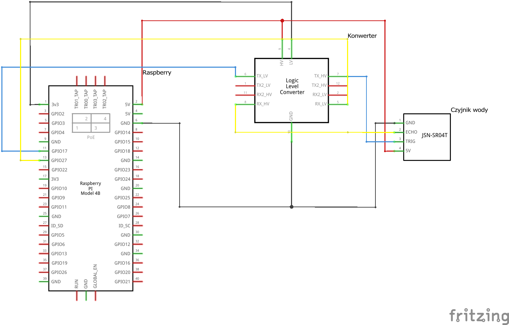

# GreenTwin 🌿🤖

System inteligentnego zarządzania szklarnią oparty na .NET i Raspberry Pi.
Projekt realizuje koncepcję "Digital Twin" – pozwala na pełną symulację
warunków przed wdrożeniem fizycznego sprzętu.

## 🚀 Główne Założenia

- **Digital Twin:** Stworzenie "Cyfrowego Bliźniaka" szklarni, gdzie centralny stan (`GreenhouseState`) odzwierciedla warunki fizyczne. Umożliwia to pełną symulację i testowanie logiki sterowania (podlewanie, ogrzewanie) przed wdrożeniem na sprzęcie.
- **Modularność i Skalowalność:** Architektura oparta na DDD (Domain-Driven Design), serwisach i kontrolerach API, ułatwiająca rozbudowę systemu o nowe czujniki i funkcje.
- **Abstrakcja Sprzętu:** Płynne przejście z trybu symulacji na fizyczne urządzenia na Raspberry Pi dzięki zastosowaniu wstrzykiwania zależności (Inversion of Control).
- **Automatyzacja:** Niezawodne procesy w tle (`IHostedService`) do zarządzania szklarnią bez ciągłej interakcji użytkownika.
- **Interfejs:** Nowoczesny panel sterowania do monitorowania i zarządzania systemem.

## 🏛️ Architektura

1.  **Warstwa Domeny (DDD):** Każdy element (czujnik, pompa) jest modelem z własną logiką (np. `SoilSensor` przeliczający wartość RAW na %).
2.  **Warstwa Usług (Services):** Dedykowane serwisy (np. `SoilSensorService`) zarządzają cyklem życia obiektów domenowych (CRUD).
3.  **Warstwa API:** Kontrolery udostępniają funkcjonalność serwisów przez punkty końcowe HTTP, stanowiąc jedyny punkt wejścia dla UI.
4.  **Silnik Symulacji:** W trybie deweloperskim, modele domenowe odczytują i zapisują swój stan do centralnego obiektu `GreenhouseState`, symulując fizyczne interakcje.

## 🛠 Tech Stack

- **Language:** C# 12 / .NET 8+
- **Platform:** Raspberry Pi (Linux ARM)
- **Libraries:** \* `System.Device.Gpio` (sterowanie pinami)
  - `Iot.Device.Bindings` (obsługa czujników)
- **Architecture:** DDD, Services, API, Inversion of Control (IoC).

## 🛠 Elementy Systemu

- **Zbiornik**: Beczka 120l
- **Czujnik poziomu wody**: JSN-SR04T (wodoodporny ultradźwiękowy)
- **Atmosfera**: BME280
- **Gleba**: Capacitive Soil Moisture
- **Przetwornik ADC**: LRS-100-12 MEAN WELL
- **Światło**: BH1750
- **Sterowanie**: Moduł przekaźnika 1-kanał z Botlandu.
- **Zasilanie**: Zasilacz do kamer 12V 5A z regulacją napięcia 4 wyjścia.
- **Pompa wody**: Pompa membranowa serii 21 DC SFDP1-011-070-21
- **Rozgałęźnik**: Rozgałęźnik zasilania Pulsar AWZ593 5x1A 10-30V DC
- **Zawory**: 12V DC 1/2"

## 📈 Status Projektu

- [x] Planowanie architektury
- [x] Zdefiniowanie szczegółowej architektury (DDD, Digital Twin)
- [ ] Implementacja silnika symulacji (w toku)
- [ ] Budowa serwisów i kontrolerów API
- [ ] Budowa UI
- [ ] Integracja z RPi (Hardware)

#### Struktura połaczeń elektrycznych

```Mermaid
graph TD
  Zasilanie[230V] --> Przetwornik[ LRS-100-12 MEAN WELL]
  Przetwornik --> Rozgałęźnik{Pulsar AWZ593}
  Rozgałęźnik --> Pompa
  Rozgałęźnik --> Zawór1
  Rozgałęźnik --> Zawór2
  Zawór1[Zawór wody sekcja 1] --> Sterowanie
  Zawór2[Zawór wody sekcja 2] --> Sterowanie
  Pompa --> Sterowanie
  Sterowanie{Moduł przekaźnika} --> Raspberry
  CzujnikWody[Sensor poziomu wody JSN-SR04T] --> Raspberry
  Beczka((Beczka120l))
  CzujnikWody -.-> Beczka
  Zasilanie --"Zasilacz Raspberry" --> Raspberry{Raspberry PI 4B}
  Raspberry --> Gleby1[Czujnik gleby sekcja 1]
  Raspberry --> Gleby2[Czujnik gleby sekcja 2]
  Raspberry --> Światło[Czujnik światła BH1750]
  Raspberry --> Atmosfera[Czujnik temperatury i wilgotności]
```

# Schematy podłaczenia czujników

### Pomiar poziomu wody/odległości przy użyciu JSN-SR04T i Raspberry Pi

Projekt przedstawia bezpieczny sposób podłączenia wodoodpornego czujnika ultradźwiękowego **JSN-SR04T** do Raspberry Pi 4B przy użyciu konwertera poziomów logicznych.

### ⚠️ Bezpieczeństwo (Kluczowa informacja)

Raspberry Pi operuje na logice **3.3V**, podczas gdy czujnik JSN-SR04T wymaga zasilania **5V** i taki też sygnał wysyła na pinie ECHO. Bezpośrednie połączenie może trwale uszkodzić piny GPIO. W tym projekcie zastosowano **konwerter poziomów logicznych**, który bezpiecznie pośredniczy w komunikacji.

### 🛠 Lista komponentów

- **Raspberry Pi** (model 4B lub dowolny inny z GPIO)
- **Czujnik JSN-SR04T** (wodoodporny)
- **Konwerter poziomów logicznych** (np. Iduino ST1167 lub podobny 4-kanałowy)
- Przewody typu jumper (męsko-męskie i żeńsko-męskie)
- Opcjonalnie: Płytka stykowa (breadboard) lub złączki WAGO 221 do rozdzielenia zasilania.

### 📐 Schemat połączenia



### Tabela połączeń

| JSN-SR04T    | Konwerter (Strona HV) | Konwerter (Strona LV) | Raspberry Pi     |
| :----------- | :-------------------- | :-------------------- | :--------------- |
| **5V (VCC)** | HV                    | -                     | Pin 2 (5V)       |
| **GND**      | GND                   | -                     | Pin 6 (GND)      |
| **TRIG**     | HV1                   | LV1                   | GPIO 17 (Pin 11) |
| **ECHO**     | HV2                   | LV2                   | GPIO 27 (Pin 13) |
| -            | -                     | **LV (Zasilanie)**    | Pin 1 (3.3V)     |
